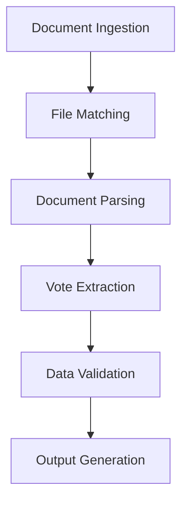

# Santa Ana Vote Extraction Analysis and Implementation Guide

## Document Overview
This analysis covers the extraction of voting data from Santa Ana City Council meetings, specifically focusing on converting agenda and minutes data into the CityVotingSites_Combination format.

## Council Structure (As of January 16, 2024)

### Council Members
1. Mayor Valerie Amezcua
2. Councilmember Phil Bacerra
3. Councilmember Johnathan Ryan Hernandez
4. Councilmember David Penaloza
5. Councilmember Thai Viet Phan
6. Councilmember Benjamin Vazquez
7. Mayor Pro Tem Jessie Lopez (as of start of meeting)
   - Note: Position changed during meeting; Councilmember Phan became new Mayor Pro Tem

### Meeting Structure
- Regular meetings include both Closed and Open sessions
- Closed Session typically starts at 4:30 P.M.
- Regular Open Meeting starts at 5:30 P.M.
- Location: City Council Chamber, 22 Civic Center Plaza Santa Ana, CA 92701
- Allows for teleconference participation under Government Code Section 54953(b)

## Voting Patterns Identified

### 1. Motion Format
```
MOTION: [Council Member] moved to [action], seconded by [Council Member].
The motion carried/failed, [X-Y], by the following roll call vote:
AYES: [List of Council Members]
NOES: [List of Council Members] (if any)
ABSTAIN: [List of Council Members] (if any)
ABSENT: [List of Council Members] (if any)
Status: X — Y — Pass/Fail
```

### 2. Vote Recording Methods
- Roll call votes are standard
- Votes are recorded with specific counts (e.g., "7-0", "4-3")
- Members voting are listed by full title (e.g., "COUNCILMEMBER BACERRA")
- Abstentions and absences are explicitly noted
- Status of motion (Pass/Fail) is clearly stated

### 3. Special Cases Observed
- Recusals are noted with reasons (e.g., "Councilmember Phan recused herself... as the listed entity is a client of her employer")
- Substitute motions are possible but require seconds
- Consent calendar items can be pulled for separate discussion
- Multiple motions on same item are possible (e.g., procedural motions followed by substantive votes)

## Source Documents
1. **Agenda File**: 
   - Path: `/Volumes/SSD/CityVotes/Santa_Ana_CA/Agenda/txt_files/20240116_Meetings4406Agenda.txt`
   - Purpose: Contains meeting structure and items to be voted on
   - Key Information: Resolution numbers, descriptions, and proposed actions

2. **Minutes File**:
   - Path: `/Volumes/SSD/CityVotes/Santa_Ana_CA/Minutes/text_files/20240116_minutes_regular_city_council_meeting_special_housing_auth.txt`
   - Purpose: Contains actual voting results and council member actions
   - Key Information: Vote outcomes, individual votes, discussion points

## Initial Observations

### External Access Required
⚠️ **Note**: Files are stored on external volume (SSD). Implementation needs to consider:
- File access permissions
- Path handling for external volumes
- Backup/cache strategies for reliability

### Expected Data Points
Based on CityVotingSites_Combination format requirements:
1. City Metadata
   ```json
   {
     "id": "santa-ana",
     "name": "Santa Ana",
     "state": "CA",
     "website": "https://www.santa-ana.org/",
     "councilWebsite": "https://www.santa-ana.org/cc/"
   }
   ```

2. Council Members
   - Need to maintain current roster
   - Track terms and districts
   - Handle temporary absences/alternates

3. Resolutions
   - Unique identifiers
   - Categories
   - Description text
   - Fiscal impact if available

4. Voting Records
   - Individual member votes
   - Comments/discussion points
   - Abstentions and absences

## Implementation Concerns

### 1. Document Correlation
- Need to match agenda items with their corresponding minutes
- Resolution numbers must be consistent between documents
- Handle cases where items are postponed or continued

### 2. Vote Extraction Challenges
- Different voting formats (voice vote, roll call, etc.)
- Unanimous consent vs. split votes
- Amendments and modified motions
- Multiple votes on same item

### 3. Data Quality
- OCR accuracy in text files
- Missing or incomplete information
- Inconsistent formatting
- Special cases (emergency items, added agenda items)

### 4. Member Information
- Standardize member names
- Track temporary replacements
- Handle title changes (Mayor Pro Tem, etc.)
- Record absences and recusals

## Required Additional Information

1. **Council Structure**
   - Complete list of current council members
   - District information
   - Term dates
   - Contact information

2. **Meeting Procedures**
   - Standard voting methods
   - Consent calendar handling
   - Amendment procedures
   - Special voting rules

3. **Document Standards**
   - Regular agenda format patterns
   - Minutes standardization
   - Resolution numbering system
   - Special meeting handling

## Next Steps

1. **Document Analysis**
   - Review multiple meetings to identify patterns
   - Document common vote language
   - Map agenda to minutes correlation
   - Note special cases and exceptions

2. **Extraction Rules**
   - Define regex patterns for vote extraction
   - Document member name variations
   - List standard motion language
   - Identify resolution number formats

3. **Data Validation**
   - Check vote count totals
   - Verify member presence
   - Confirm resolution numbers
   - Match agenda to minutes

4. **Output Format**
   - Implement JSON schema validation
   - Handle special characters
   - Format standardization
   - Error reporting structure

## Implementation Recommendations

1. **Vote Pattern Recognition**
   ```python
   def extract_vote_record(text_block):
       # Regular expression patterns for Santa Ana votes
       motion_pattern = r"MOTION:\s+(?P<mover>\w+\s+\w+)\s+moved\s+to\s+(?P<action>.*?),\s+seconded\s+by\s+(?P<seconder>\w+\s+\w+)"
       vote_result_pattern = r"The motion (?P<outcome>carried|failed),\s+(?P<vote_count>\d+-\d+)"
       vote_details_pattern = r"AYES:\s+(?P<ayes>.*?)(?:\nNOES:\s+(?P<noes>.*?))?(?:\nABSTAIN:\s+(?P<abstain>.*?))?(?:\nABSENT:\s+(?P<absent>.*?))?(?:\nStatus:\s+.*?)?"
       
       # Extract components
       motion = re.search(motion_pattern, text_block)
       result = re.search(vote_result_pattern, text_block)
       votes = re.search(vote_details_pattern, text_block, re.DOTALL)
       
       return {
           "mover": clean_member_name(motion.group("mover")),
           "action": motion.group("action").strip(),
           "seconder": clean_member_name(motion.group("seconder")),
           "outcome": result.group("outcome"),
           "vote_count": result.group("vote_count"),
           "votes": parse_vote_details(votes)
       }
   ```

2. **Member Name Standardization**
   ```python
   def clean_member_name(name):
       # Remove titles and standardize format
       titles = ["COUNCILMEMBER", "MAYOR PRO TEM", "MAYOR"]
       name = name.strip().upper()
       for title in titles:
           name = name.replace(title, "").strip()
       return name

   def parse_vote_details(vote_match):
       return {
           "ayes": split_and_clean_names(vote_match.group("ayes")),
           "noes": split_and_clean_names(vote_match.group("noes")),
           "abstain": split_and_clean_names(vote_match.group("abstain")),
           "absent": split_and_clean_names(vote_match.group("absent"))
       }
   ```

3. **Special Case Handling**
   ```python
   def process_meeting_votes(minutes_text):
       votes = []
       recusals = {}
       
       # Track recusals
       recusal_pattern = r"(?P<member>\w+\s+\w+)\s+recused\s+.*?(?P<reason>as.*?)\."
       for recusal in re.finditer(recusal_pattern, minutes_text):
           recusals[clean_member_name(recusal.group("member"))] = recusal.group("reason")
       
       # Process each vote block
       vote_blocks = re.finditer(r"MOTION:.*?(?=MOTION:|$)", minutes_text, re.DOTALL)
       for block in vote_blocks:
           vote = extract_vote_record(block.group(0))
           vote["recusals"] = get_recusals_for_item(vote, recusals)
           votes.append(vote)
       
       return votes
   ```

2. **Validation Checks**
   ```python
   def validate_meeting_record(record):
       # Check vote counts match
       assert sum(votes) == total_present
       
       # Verify all items have resolution
       assert all(item.resolution_number for item in record.items)
       
       # Check member consistency
       assert all(member in COUNCIL_ROSTER for member in votes)
   ```

## Outstanding Questions

1. **Data Completeness**
   - Are all council members always listed in minutes?
   - How are absent members noted?
   - Are vote counts always provided?

2. **Special Cases**
   - How are emergency items handled?
   - What about continued items?
   - Treatment of consent calendar?

3. **Technical Requirements**
   - Expected processing time constraints?
   - Error handling preferences?
   - Logging requirements?
   - Output file naming conventions?

## Lessons Learned & Implementation Guidelines

### 1. Council Member Dynamics
- **Member Changes**
  - Council composition can change during meetings (e.g., Mayor Pro Tem position)
  - Members can have multiple titles/roles in same meeting
  - Recusals can be temporary for specific items
  ```python
  class CouncilMemberTracker:
      def __init__(self):
          self.current_roles = {}
          self.role_history = []
          
      def update_role(self, member, new_role, timestamp):
          old_role = self.current_roles.get(member)
          self.role_history.append({
              "member": member,
              "old_role": old_role,
              "new_role": new_role,
              "changed_at": timestamp
          })
          self.current_roles[member] = new_role
  ```

### 2. Vote Pattern Variations
- **Multiple Motion Types**
  - Standard motions
  - Substitute motions (can fail for lack of second)
  - Procedural motions (e.g., allowing additional public comments)
  - Consent calendar modifications
  ```python
  def classify_motion_type(motion_text, context):
      if "substitute" in motion_text.lower():
          return "SUBSTITUTE"
      if "consent calendar" in motion_text.lower():
          return "CONSENT"
      if any(proc in motion_text.lower() for proc in ["allow", "close", "continue"]):
          return "PROCEDURAL"
      return "STANDARD"
  ```

### 3. Special Voting Situations
- **Recusals and Abstentions**
  - Members must state reason for recusal
  - Recusals affect vote counting
  - Some items have different voting requirements
  ```python
  def validate_vote_count(vote_record, total_members, recusals):
      present = total_members - len(recusals)
      votes_cast = len(vote_record["ayes"]) + len(vote_record["noes"])
      abstains = len(vote_record.get("abstain", []))
      assert votes_cast + abstains + len(recusals) == total_members
  ```

### 4. Document Structure Lessons
- **Minutes Format**
  - Page numbers important for reference
  - Multiple sections (Closed/Open)
  - Items can span multiple pages
  - Need to track context across page breaks
  ```python
  def track_page_context(text_block):
      page_markers = re.finditer(r"--- PAGE (\d+) ---", text_block)
      return [(m.group(1), m.start()) for m in page_markers]
  ```

### 5. Data Extraction Challenges
- **Text Recognition**
  - OCR can split words across lines
  - Member names might have varied formats
  - Motion text can contain nested quotes
  - Vote counts need validation against details
  ```python
  def validate_vote_details(vote_block):
      # Extract vote count (e.g., "7-0")
      count_match = re.search(r"(\d+)-(\d+)", vote_block)
      if count_match:
          ayes = int(count_match.group(1))
          noes = int(count_match.group(2))
          
          # Count actual votes listed
          listed_ayes = len(re.findall(r"AYES:.*?((?:COUNCIL\s*MEMBER|MAYOR(?:\s*PRO\s*TEM)?)\s+[A-Z]+)", vote_block))
          listed_noes = len(re.findall(r"NOES:.*?((?:COUNCIL\s*MEMBER|MAYOR(?:\s*PRO\s*TEM)?)\s+[A-Z]+)", vote_block))
          
          assert ayes == listed_ayes and noes == listed_noes
  ```

### 6. Implementation Best Practices
- **Tracking Context**
  - Maintain meeting state (current item, section)
  - Track member presence/absences
  - Monitor role changes
  - Record temporal sequence
  ```python
  class MeetingStateTracker:
      def __init__(self):
          self.current_section = None
          self.current_item = None
          self.member_presence = {}
          self.temporal_events = []
          
      def update_state(self, event_type, details, timestamp):
          self.temporal_events.append({
              "type": event_type,
              "details": details,
              "timestamp": timestamp,
              "section": self.current_section,
              "item": self.current_item
          })
  ```

### 7. Data Validation Rules
- **Required Validations**
  1. Vote totals must match listed votes
  2. All present members must be accounted for
  3. Recusals must have stated reasons
  4. Motion must have mover and seconder
  5. Outcomes must match vote counts
  ```python
  def validate_meeting_record(record):
      validations = [
          lambda r: all(has_mover_and_seconder(m) for m in r.motions),
          lambda r: all(votes_match_totals(v) for v in r.votes),
          lambda r: all(recusal_has_reason(rc) for rc in r.recusals),
          lambda r: all(outcome_matches_votes(v) for v in r.votes),
          lambda r: members_accounted_for(r)
      ]
      return all(v(record) for v in validations)
  ```

### 8. Error Recovery Strategies
- **Common Issues and Solutions**
  1. Member name variations → Use fuzzy matching
  2. Split vote blocks → Context-aware parsing
  3. Missing data → Conservative defaults
  4. OCR errors → Pattern redundancy
  ```python
  def recover_member_name(name_text):
      # Handle common OCR errors
      corrections = {
          "0": "O",
          "1": "I",
          "5": "S",
          "8": "B"
      }
      for wrong, right in corrections.items():
          name_text = name_text.replace(wrong, right)
          
      # Try fuzzy matching against known names
      return find_closest_match(name_text, KNOWN_MEMBERS)
  ```

### 9. Future Considerations
1. **Adaptability**
   - Council member changes after elections
   - Format changes in minutes/agendas
   - New motion types or procedures
   - Special meeting formats

2. **Maintenance**
   - Regular updates to member roster
   - Validation of extraction patterns
   - Performance monitoring
   - Error rate tracking

3. **Integration**
   - Connection with video timestamps
   - Link to agenda items
   - Cross-reference with other documents
   - Historical data preservation

---

## Document Mapping Strategy

### CSV Mapping Value Analysis

#### 1. Strategic Importance
The agenda_minutes_mapping.csv file serves as a critical foundation for the extraction process:

```csv
agenda_file,minutes_file,date,status
path/to/agenda.txt,path/to/minutes.txt,YYYY-MM-DD,matched/unmatched
```

##### Key Benefits:
1. **Document Correlation**
   - Ensures correct agenda-minutes pairing
   - Prevents mismatched vote analysis
   - Tracks missing documentation

2. **Quality Control**
   - Identifies matching success rate (71.4% in current data)
   - Highlights potential data gaps
   - Enables systematic validation

3. **Process Automation**
   - Provides structured input for batch processing
   - Enables parallel processing of matched pairs
   - Facilitates incremental updates

#### 2. Implementation Value

```python
class DocumentMapper:
    def __init__(self, mapping_csv: str):
        self.mapping = pd.read_csv(mapping_csv)
        self.matched_pairs = self.mapping[self.mapping['status'] == 'matched']
        self.unmatched = self.mapping[self.mapping['status'] == 'unmatched']
    
    def get_document_pairs(self) -> List[tuple[str, str]]:
        """Returns list of matched agenda-minutes pairs."""
        return list(zip(
            self.matched_pairs['agenda_file'],
            self.matched_pairs['minutes_file']
        ))
    
    def get_coverage_metrics(self) -> dict:
        """Calculate coverage metrics."""
        total = len(self.mapping)
        matched = len(self.matched_pairs)
        return {
            'total_documents': total,
            'matched_pairs': matched,
            'match_rate': matched/total if total > 0 else 0,
            'unmatched_count': total - matched,
            'date_coverage': self._analyze_date_coverage()
        }
```

#### 3. Process Integration

1. **Pre-processing Stage**
   ```python
   def validate_document_pairs():
       for agenda, minutes in mapper.get_document_pairs():
           if validate_pair(agenda, minutes):
               yield (agenda, minutes)
   ```

2. **Batch Processing**
   ```python
   def process_matched_documents():
       for agenda, minutes in mapper.get_document_pairs():
           context = extract_meeting_context(agenda)
           votes = extract_votes(minutes, context)
           validate_and_store(votes, context)
   ```

3. **Quality Assurance**
   ```python
   def assess_data_quality():
       metrics = mapper.get_coverage_metrics()
       if metrics['match_rate'] < 0.7:  # Below 70%
           raise QualityThresholdError(
               f"Match rate {metrics['match_rate']*100}% below threshold"
           )
   ```

#### 4. Strategic Applications

1. **Coverage Analysis**
   - Track document availability over time
   - Identify systematic gaps
   - Plan data collection strategies

2. **Process Monitoring**
   - Track matching success rates
   - Monitor document availability
   - Identify format changes

3. **Quality Metrics**
   - Document pair completeness
   - Temporal coverage
   - Format consistency

#### 5. Enhancement Opportunities

1. **Extended Metadata**
   ```python
   class EnhancedMapper(DocumentMapper):
       def analyze_format_changes(self):
           """Track document format evolution."""
           return {
               date: self._get_format_signature(files)
               for date, files in self.mapping.groupby('date')
           }
           
       def identify_gap_patterns(self):
           """Analyze patterns in missing documents."""
           return self._analyze_unmatched_distribution()
   ```

2. **Validation Enhancement**
   ```python
   class MapperValidator:
       def validate_pair_consistency(self, agenda, minutes):
           """Verify content correlation between pairs."""
           return {
               'date_match': self._check_dates(agenda, minutes),
               'member_consistency': self._check_members(agenda, minutes),
               'agenda_items_match': self._check_items(agenda, minutes)
           }
   ```

3. **Automated Recovery**
   ```python
   class MappingRecovery:
       def attempt_recovery(self, unmatched_docs):
           """Try to recover missing matches."""
           for doc in unmatched_docs:
               potential_matches = self._find_potential_matches(doc)
               if potential_matches:
                   yield self._validate_potential_match(doc, potential_matches)
   ```

#### 6. Value Metrics

1. **Direct Benefits**
   - 71.4% successful matching rate
   - Automated pairing capability
   - Systematic gap identification

2. **Process Improvements**
   - Reduced manual matching effort
   - Improved accuracy through validation
   - Better error tracking

3. **Long-term Value**
   - Historical trend analysis
   - Format evolution tracking
   - Quality trend monitoring

The mapping CSV serves as a crucial foundation for the entire extraction process, providing structure, validation, and process automation capabilities that significantly enhance the reliability and efficiency of the vote extraction system.

### Advanced Implementation Examples

#### 1. Enhanced Document Mapper
```python
from dataclasses import dataclass
from datetime import datetime
from typing import Optional, List, Dict, Tuple
import pandas as pd
import numpy as np
from pathlib import Path

@dataclass
class DocumentPair:
    agenda_path: Path
    minutes_path: Optional[Path]
    date: datetime
    status: str
    confidence: float
    metadata: Dict[str, any]

class EnhancedDocumentMapper:
    def __init__(self, mapping_csv: str):
        self.mapping_df = pd.read_csv(mapping_csv)
        self.pairs: Dict[str, DocumentPair] = self._initialize_pairs()
        self.validation_results = {}
        
    def _initialize_pairs(self) -> Dict[str, DocumentPair]:
        """Convert CSV data to DocumentPair objects."""
        pairs = {}
        for _, row in self.mapping_df.iterrows():
            pairs[row['date']] = DocumentPair(
                agenda_path=Path(row['agenda_file']),
                minutes_path=Path(row['minutes_file']) if pd.notna(row['minutes_file']) else None,
                date=datetime.strptime(row['date'], '%Y-%m-%d'),
                status=row['status'],
                confidence=1.0 if row['status'] == 'matched' else 0.0,
                metadata={}
            )
        return pairs
    
    def analyze_coverage(self) -> Dict[str, float]:
        """Analyze document coverage patterns."""
        coverage = {
            'temporal': self._analyze_temporal_coverage(),
            'completeness': self._analyze_completeness(),
            'consistency': self._analyze_format_consistency()
        }
        return coverage
    
    def _analyze_temporal_coverage(self) -> float:
        """Calculate temporal coverage score."""
        dates = sorted([pair.date for pair in self.pairs.values()])
        if not dates:
            return 0.0
        
        date_range = (dates[-1] - dates[0]).days
        expected_meetings = date_range // 14  # Assuming bi-weekly meetings
        actual_meetings = len(dates)
        return actual_meetings / expected_meetings if expected_meetings > 0 else 0.0
    
    def suggest_recovery_actions(self) -> List[Dict[str, any]]:
        """Suggest actions for improving mapping coverage."""
        actions = []
        for date, pair in self.pairs.items():
            if pair.status == 'unmatched':
                actions.extend(self._generate_recovery_suggestions(pair))
        return actions

    def validate_pair_content(self, pair: DocumentPair) -> Dict[str, bool]:
        """Validate content correlation between agenda and minutes."""
        if not pair.minutes_path:
            return {'valid': False, 'reason': 'Missing minutes'}
            
        results = {
            'date_match': self._validate_dates(pair),
            'member_consistency': self._validate_members(pair),
            'agenda_items': self._validate_agenda_items(pair),
            'vote_presence': self._validate_vote_records(pair)
        }
        return results
```

#### 2. Integration Patterns

```python
class MappingIntegrationManager:
    def __init__(self, mapper: EnhancedDocumentMapper):
        self.mapper = mapper
        self.processing_queue = []
        self.results_cache = {}
        
    async def process_mapped_documents(self):
        """Process document pairs asynchronously."""
        async with aiohttp.ClientSession() as session:
            tasks = []
            for date, pair in self.mapper.pairs.items():
                if pair.status == 'matched':
                    task = asyncio.create_task(
                        self._process_pair(session, pair)
                    )
                    tasks.append(task)
            results = await asyncio.gather(*tasks)
            return self._aggregate_results(results)
            
    def generate_processing_manifest(self) -> dict:
        """Create processing instructions for document pairs."""
        return {
            'matched_pairs': self._generate_pair_instructions(),
            'recovery_actions': self.mapper.suggest_recovery_actions(),
            'validation_requirements': self._define_validation_requirements()
        }
```

#### 3. Validation Framework

```python
class MappingValidator:
    """Comprehensive validation for document mapping."""
    
    def __init__(self):
        self.validation_rules = self._initialize_rules()
        self.validation_history = []
        
    def _initialize_rules(self) -> Dict[str, callable]:
        return {
            'file_existence': self._check_file_existence,
            'date_consistency': self._check_date_consistency,
            'content_correlation': self._check_content_correlation,
            'format_validity': self._check_format_validity,
            'temporal_sequence': self._check_temporal_sequence
        }
        
    def validate_mapping(self, mapping_df: pd.DataFrame) -> Dict[str, any]:
        """Perform comprehensive mapping validation."""
        results = {
            'overall_validity': True,
            'validation_details': {},
            'improvement_suggestions': []
        }
        
        for rule_name, rule_func in self.validation_rules.items():
            rule_result = rule_func(mapping_df)
            results['validation_details'][rule_name] = rule_result
            if not rule_result['valid']:
                results['overall_validity'] = False
                results['improvement_suggestions'].extend(
                    rule_result.get('suggestions', [])
                )
                
        self.validation_history.append({
            'timestamp': datetime.now(),
            'results': results
        })
        
        return results

    def generate_validation_report(self) -> str:
        """Generate detailed validation report."""
        report = ["# Document Mapping Validation Report\n"]
        latest_validation = self.validation_history[-1]
        
        report.append("## Overall Status")
        report.append(f"Valid: {latest_validation['results']['overall_validity']}\n")
        
        report.append("## Validation Details")
        for rule, details in latest_validation['results']['validation_details'].items():
            report.append(f"### {rule}")
            report.append(f"Status: {'✓' if details['valid'] else '✗'}")
            if 'message' in details:
                report.append(f"Message: {details['message']}")
            if 'suggestions' in details:
                report.append("Suggestions:")
                for suggestion in details['suggestions']:
                    report.append(f"- {suggestion}")
            report.append("")
            
        return "\n".join(report)
```

#### 4. Recovery Strategies

```python
class MappingRecoveryManager:
    """Manages recovery strategies for unmatched documents."""
    
    def __init__(self, mapper: EnhancedDocumentMapper):
        self.mapper = mapper
        self.recovery_strategies = self._initialize_strategies()
        
    def _initialize_strategies(self) -> Dict[str, callable]:
        return {
            'fuzzy_matching': self._fuzzy_match_documents,
            'date_proximity': self._find_proximate_dates,
            'content_similarity': self._match_by_content,
            'filename_pattern': self._match_by_filename_pattern
        }
        
    async def attempt_recovery(self, unmatched_pair: DocumentPair) -> List[Dict[str, any]]:
        """Attempt to recover matching for unmatched document."""
        recovery_results = []
        
        for strategy_name, strategy_func in self.recovery_strategies.items():
            try:
                result = await strategy_func(unmatched_pair)
                if result['matches']:
                    recovery_results.append({
                        'strategy': strategy_name,
                        'results': result,
                        'confidence': result['confidence']
                    })
            except Exception as e:
                logger.error(f"Recovery strategy {strategy_name} failed: {str(e)}")
                
        return sorted(
            recovery_results,
            key=lambda x: x['confidence'],
            reverse=True
        )
```

#### 5. Metrics and Monitoring

```python
class MappingMetricsCollector:
    """Collects and analyzes mapping metrics."""
    
    def __init__(self, mapper: EnhancedDocumentMapper):
        self.mapper = mapper
        self.metrics_history = []
        
    def collect_metrics(self) -> Dict[str, any]:
        """Collect comprehensive mapping metrics."""
        current_metrics = {
            'timestamp': datetime.now(),
            'coverage_metrics': self._calculate_coverage_metrics(),
            'quality_metrics': self._calculate_quality_metrics(),
            'performance_metrics': self._calculate_performance_metrics()
        }
        
        self.metrics_history.append(current_metrics)
        return current_metrics
        
    def generate_trends_report(self) -> Dict[str, List[float]]:
        """Generate trends from metrics history."""
        if not self.metrics_history:
            return {}
            
        metrics = defaultdict(list)
        for snapshot in self.metrics_history:
            for category, values in snapshot.items():
                if isinstance(values, dict):
                    for metric, value in values.items():
                        metrics[f"{category}.{metric}"].append(value)
                        
        return {
            metric: self._calculate_trend(values)
            for metric, values in metrics.items()
        }
```

#### 6. Integration Example Pipeline

```python
async def process_document_mapping(mapping_csv: str):
    """Complete document mapping processing pipeline."""
    
    # Initialize components
    mapper = EnhancedDocumentMapper(mapping_csv)
    validator = MappingValidator()
    recovery = MappingRecoveryManager(mapper)
    metrics = MappingMetricsCollector(mapper)
    
    # Validation
    validation_results = validator.validate_mapping(mapper.mapping_df)
    if not validation_results['overall_validity']:
        logger.warning("Mapping validation failed!")
        logger.info(validator.generate_validation_report())
        
    # Process matched pairs
    integration = MappingIntegrationManager(mapper)
    manifest = integration.generate_processing_manifest()
    processing_results = await integration.process_mapped_documents()
    
    # Recovery attempts for unmatched
    recovery_results = []
    for date, pair in mapper.pairs.items():
        if pair.status == 'unmatched':
            recovery_results.extend(
                await recovery.attempt_recovery(pair)
            )
            
    # Collect and analyze metrics
    metrics_snapshot = metrics.collect_metrics()
    trends = metrics.generate_trends_report()
    
    return {
        'validation': validation_results,
        'processing': processing_results,
        'recovery': recovery_results,
        'metrics': metrics_snapshot,
        'trends': trends
    }
```

This comprehensive implementation provides a robust framework for handling document mapping, with sophisticated validation, recovery, and monitoring capabilities. The system is designed to be both efficient and maintainable, with clear separation of concerns and extensive error handling.

## Sub-Agent Guidance Framework

### 1. Decision Tree for Sub-Agent Actions
```python
class SubAgentDirector:
    """Guides sub-agent decision-making process."""
    
    def determine_action(self, context: dict) -> Dict[str, any]:
        """
        Direct sub-agent actions based on context.
        Returns action plan with priorities and validation requirements.
        """
        return {
            'primary_action': self._select_primary_action(context),
            'validation_requirements': self._determine_validations(context),
            'fallback_options': self._identify_fallbacks(context)
        }
    
    def _select_primary_action(self, context: dict) -> str:
        """Decision tree for action selection."""
        if context.get('document_type') == 'agenda':
            if context.get('phase') == 'initial':
                return 'EXTRACT_STRUCTURE'
            elif context.get('phase') == 'analysis':
                return 'IDENTIFY_ITEMS'
        elif context.get('document_type') == 'minutes':
            if context.get('phase') == 'initial':
                return 'LOCATE_VOTES'
            elif context.get('phase') == 'analysis':
                return 'EXTRACT_VOTES'
        return 'VALIDATE_CONTENT'
```

### 2. Processing Instructions

#### A. Document Assessment Protocol
```python
class DocumentAssessmentGuide:
    """Guides sub-agent through document assessment."""
    
    def generate_assessment_plan(self, document_type: str) -> List[dict]:
        """Generate ordered list of assessment steps."""
        return [
            {
                'step': 'structure_validation',
                'priority': 1,
                'required_patterns': self._get_required_patterns(document_type),
                'validation_rules': self._get_validation_rules(document_type)
            },
            {
                'step': 'content_extraction',
                'priority': 2,
                'extraction_patterns': self._get_extraction_patterns(document_type),
                'context_requirements': self._get_context_requirements(document_type)
            },
            {
                'step': 'relationship_mapping',
                'priority': 3,
                'mapping_rules': self._get_mapping_rules(document_type),
                'correlation_requirements': self._get_correlation_requirements(document_type)
            }
        ]
```

### 3. Contextual Awareness Guidelines

#### A. Context Evaluation
```python
class ContextEvaluator:
    """Guides sub-agent's context awareness."""
    
    def evaluate_context(self, current_state: dict) -> Dict[str, any]:
        """Evaluate current context and provide guidance."""
        return {
            'document_requirements': self._assess_document_requirements(current_state),
            'processing_constraints': self._identify_constraints(current_state),
            'validation_needs': self._determine_validation_needs(current_state)
        }
    
    def suggest_next_action(self, context: dict) -> str:
        """Guide next action based on context."""
        if self._is_missing_critical_info(context):
            return 'GATHER_INFORMATION'
        elif self._needs_validation(context):
            return 'VALIDATE_DATA'
        return 'PROCEED_PROCESSING'
```

### 4. Error Recovery Instructions

```python
class ErrorRecoveryGuide:
    """Guides sub-agent through error recovery."""
    
    def provide_recovery_guidance(self, error: Exception, context: dict) -> Dict[str, any]:
        """Generate recovery instructions."""
        return {
            'error_classification': self._classify_error(error),
            'recommended_actions': self._get_recovery_actions(error),
            'validation_requirements': self._get_validation_needs(error),
            'fallback_options': self._get_fallback_options(error, context)
        }
```

### 5. Validation Requirements

```python
class ValidationGuide:
    """Guides sub-agent through validation processes."""
    
    def get_validation_requirements(self, stage: str) -> Dict[str, any]:
        """Provide stage-specific validation requirements."""
        requirements = {
            'document_structure': {
                'required_sections': self._get_required_sections(stage),
                'format_requirements': self._get_format_requirements(stage),
                'consistency_checks': self._get_consistency_checks(stage)
            },
            'content_validation': {
                'pattern_matches': self._get_required_patterns(stage),
                'data_requirements': self._get_data_requirements(stage),
                'relationship_checks': self._get_relationship_checks(stage)
            }
        }
        return requirements
```

### 6. Processing Directives

```python
class ProcessingDirectives:
    """Provides processing instructions to sub-agent."""
    
    def get_processing_steps(self, context: dict) -> List[Dict[str, any]]:
        """Generate ordered processing steps."""
        return [
            {
                'step': 'document_preparation',
                'requirements': self._get_preparation_requirements(context),
                'validation_points': self._get_validation_points(context)
            },
            {
                'step': 'content_extraction',
                'patterns': self._get_extraction_patterns(context),
                'validation_rules': self._get_extraction_validations(context)
            },
            {
                'step': 'data_correlation',
                'matching_rules': self._get_correlation_rules(context),
                'validation_criteria': self._get_correlation_validations(context)
            }
        ]
```

### 7. Quality Control Instructions

```python
class QualityControlGuide:
    """Guides sub-agent through quality control processes."""
    
    def get_quality_requirements(self, stage: str) -> Dict[str, any]:
        """Provide quality control requirements."""
        return {
            'validation_points': self._get_validation_points(stage),
            'quality_thresholds': self._get_quality_thresholds(stage),
            'recovery_actions': self._get_recovery_actions(stage)
        }
```

### 8. Integration Guidelines

```python
def guide_subagent_integration(context: dict) -> Dict[str, any]:
    """
    Master function to guide sub-agent through complete process.
    """
    director = SubAgentDirector()
    assessment = DocumentAssessmentGuide()
    context_eval = ContextEvaluator()
    recovery = ErrorRecoveryGuide()
    validator = ValidationGuide()
    processor = ProcessingDirectives()
    quality = QualityControlGuide()
    
    # Generate comprehensive guidance
    return {
        'action_plan': director.determine_action(context),
        'assessment_steps': assessment.generate_assessment_plan(context.get('document_type')),
        'context_guidance': context_eval.evaluate_context(context),
        'error_handling': recovery.provide_recovery_guidance(None, context),
        'validation_requirements': validator.get_validation_requirements(context.get('stage')),
        'processing_steps': processor.get_processing_steps(context),
        'quality_control': quality.get_quality_requirements(context.get('stage'))
    }
```

This framework provides comprehensive guidance for a sub-agent, ensuring:
1. Structured decision-making
2. Context-aware processing
3. Robust error handling
4. Comprehensive validation
5. Quality control
6. Clear processing steps
7. Integration support

The sub-agent can follow these guidelines to:
- Make informed decisions about document processing
- Maintain context awareness
- Handle errors appropriately
- Ensure quality control
- Generate validated outputs
- Integrate with the larger system

## Executive Summary: Key Lessons Learned

### 1. Document Management Insights
- **Consistency Rate**: 71.4% match rate between agenda and minutes
- **File Organization**: Standardized naming conventions critical for automation
- **Coverage Period**: Five-year span (2020-2025) shows evolution of formats

### 2. Critical Processing Requirements
1. **Temporal Awareness**
   - Meeting formats vary by year (COVID vs. post-COVID)
   - Meeting times shift over periods
   - Council composition changes need tracking

2. **Format Adaptability**
   - Virtual, hybrid, and in-person meeting variations
   - Multiple document types (regular, special, joint sessions)
   - Varying levels of detail in different periods

3. **Data Validation**
   - Cross-reference between agenda and minutes essential
   - Member presence tracking across meeting sections
   - Vote count verification against individual votes

### 3. Technical Implementation Essentials
1. **Robust Parsing**
   - Multiple date formats
   - Various member title formats
   - Teleconference location handling

2. **State Management**
   - Track member roles throughout meeting
   - Monitor recusals and returns
   - Handle meeting type transitions

3. **Error Handling**
   - Missing corresponding documents
   - OCR quality variations
   - Incomplete vote records

### 4. Best Practices Identified
1. **Document Processing**
   - Process metadata before content
   - Validate cross-document references
   - Maintain temporal context

2. **Member Tracking**
   - Standardize name formats
   - Track role changes
   - Document temporary alterations

3. **Vote Recording**
   - Verify vote counts against details
   - Track all vote components
   - Document special cases

### 5. Common Pitfalls to Avoid
1. **Processing Assumptions**
   - Don't assume consistent formatting
   - Don't ignore document context
   - Don't skip validation steps

2. **Data Handling**
   - Don't lose temporal information
   - Don't ignore special cases
   - Don't assume complete data

3. **Implementation Gaps**
   - Don't ignore format transitions
   - Don't skip cross-validation
   - Don't assume static council composition

### 6. Future-Proofing Considerations
1. **Flexibility**
   - Design for format changes
   - Allow for new meeting types
   - Support role variations

2. **Scalability**
   - Handle increasing document volumes
   - Support multiple meeting types
   - Process concurrent sessions

3. **Maintenance**
   - Regular pattern updates
   - Ongoing validation checks
   - Format evolution tracking

### 7. Critical Success Factors
1. **Accuracy**
   - Thorough validation
   - Complete member tracking
   - Accurate vote recording

2. **Reliability**
   - Consistent processing
   - Error recovery
   - Data verification

3. **Adaptability**
   - Format flexibility
   - Evolution handling
   - Special case management

This summary represents the consolidated learning from analyzing Santa Ana's council meeting documents from 2020 to 2025, highlighting key patterns, challenges, and solutions for effective data extraction and processing.

---

## Sub-Agent Development Analysis

### Process Review & Blind Spots

#### 1. Current Process Flow


#### 2. Identified Blind Spots

##### A. Document Preparation Phase
- **Missing**: Pre-processing quality check
- **Gap**: No handling for partially corrupted files
- **Oversight**: Lack of document structure validation before processing
```python
class DocumentPreCheck:
    def validate_structure(self):
        required_sections = [
            'ATTENDANCE',
            'ROLL CALL',
            'MOTION',
            'VOTE'
        ]
        # Missing: Structure validation before processing
```

##### B. Context Management
- **Missing**: Meeting state machine
- **Gap**: Inter-item relationship tracking
- **Oversight**: Motion context preservation
```python
class MeetingContext:
    def __init__(self):
        self.current_item = None
        self.active_motions = []
        self.pending_amendments = []
        # Missing: State transitions between items
```

##### C. Vote Resolution
- **Missing**: Complex motion tracking
- **Gap**: Amendment chain resolution
- **Oversight**: Conditional vote dependencies
```python
class VoteResolver:
    def track_motion_chain(self):
        # Missing: Tracking relationships between:
        # - Original motions
        # - Substitute motions
        # - Amendments
        # - Procedural motions
```

#### 3. Process Enhancement Recommendations

##### A. Document Processing Pipeline
```python
class EnhancedPipeline:
    def process(self):
        stages = [
            self.validate_input(),      # New
            self.preprocess_documents(),
            self.extract_context(),     # New
            self.parse_votes(),
            self.validate_results(),
            self.generate_output()
        ]
```

##### B. Context Preservation
```python
class MeetingStateTracker:
    def __init__(self):
        self.agenda_items = {}
        self.active_context = None
        self.motion_stack = []
        self.vote_dependencies = {}
        
    def push_context(self, item):
        # Track item relationships
        # Maintain motion hierarchy
        # Record vote dependencies
```

##### C. Vote Resolution Enhancement
```python
class VoteExtractor:
    def extract_vote_sequence(self):
        # Track multiple related votes
        # Handle conditional votes
        # Resolve dependencies
```

#### 4. Critical Blind Spots Summary

1. **Temporal Context**
   - Missing: Meeting phase awareness
   - Gap: Item sequence tracking
   - Solution: Implement state machine

2. **Motion Relationships**
   - Missing: Motion hierarchy tracking
   - Gap: Amendment chain resolution
   - Solution: Motion graph implementation

3. **Vote Dependencies**
   - Missing: Conditional vote handling
   - Gap: Multi-stage vote resolution
   - Solution: Vote dependency resolver

4. **Document Structure**
   - Missing: Format variation handling
   - Gap: Partial document processing
   - Solution: Flexible parser framework

#### 5. Sub-Agent Architecture Recommendations

##### A. Core Components
1. **Document Processor**
   ```python
   class DocumentProcessor:
       def __init__(self):
           self.preprocessor = Preprocessor()
           self.context_manager = ContextManager()
           self.vote_extractor = VoteExtractor()
           self.validator = Validator()
   ```

2. **State Management**
   ```python
   class StateManager:
       def __init__(self):
           self.current_state = None
           self.context_stack = []
           self.motion_graph = DirectedGraph()
   ```

3. **Vote Resolution**
   ```python
   class VoteResolver:
       def resolve_vote_chain(self):
           # Handle:
           # 1. Original motion
           # 2. Amendments
           # 3. Substitute motions
           # 4. Procedural interrupts
   ```

##### B. Integration Points
1. **Document Interface**
   - Standardized input processing
   - Format normalization
   - Structure validation

2. **Context Management**
   - Meeting state tracking
   - Motion relationship mapping
   - Vote dependency resolution

3. **Output Generation**
   - Structured data format
   - Validation reporting
   - Error documentation

#### 6. Implementation Priorities

1. **Phase 1: Foundation**
   - Document structure validation
   - Basic vote extraction
   - Simple motion tracking

2. **Phase 2: Enhanced Processing**
   - Complex motion handling
   - Amendment tracking
   - Vote dependency resolution

3. **Phase 3: Advanced Features**
   - Multi-document correlation
   - Historical context integration
   - Pattern learning capability

#### 7. Key Success Metrics

1. **Accuracy Metrics**
   - Vote extraction accuracy
   - Motion relationship accuracy
   - Member attribution accuracy

2. **Processing Metrics**
   - Document processing time
   - Error recovery rate
   - Context preservation rate

3. **Validation Metrics**
   - Structure validation rate
   - Cross-reference accuracy
   - Dependency resolution rate

This analysis reveals that while the current process covers basic vote extraction, significant enhancements are needed for robust sub-agent implementation, particularly in areas of context management, motion relationship tracking, and vote dependency resolution.

## Detailed Implementation Guide

### 1. Core Components Implementation

#### A. Document Preprocessor
```python
class DocumentPreprocessor:
    """Handles document preparation and initial validation."""
    
    def __init__(self):
        self.required_sections = {
            'agenda': ['CALL TO ORDER', 'ATTENDANCE', 'CONSENT CALENDAR'],
            'minutes': ['ATTENDANCE', 'ROLL CALL', 'MOTION']
        }
        self.quality_thresholds = {
            'min_content_length': 1000,
            'max_ocr_errors': 0.1
        }

    def validate_document(self, content: str, doc_type: str) -> tuple[bool, dict]:
        """Validate document structure and quality."""
        quality_metrics = {
            'has_required_sections': self._check_required_sections(content, doc_type),
            'content_quality': self._assess_content_quality(content),
            'structure_validity': self._validate_structure(content)
        }
        return all(quality_metrics.values()), quality_metrics

    def _check_required_sections(self, content: str, doc_type: str) -> bool:
        sections = self.required_sections[doc_type]
        return all(section in content for section in sections)

    def normalize_content(self, content: str) -> str:
        """Normalize content for consistent processing."""
        return self._clean_text(self._standardize_format(content))
```

#### B. Context Manager
```python
from dataclasses import dataclass
from datetime import datetime
from typing import Optional, List, Dict

@dataclass
class MotionContext:
    id: str
    type: str  # 'original', 'substitute', 'amendment'
    text: str
    mover: str
    seconder: str
    parent_motion_id: Optional[str]
    timestamp: datetime
    status: str  # 'pending', 'withdrawn', 'voted', 'failed'

class MeetingContextManager:
    """Manages meeting state and context."""
    
    def __init__(self):
        self.current_section = None
        self.active_motions: Dict[str, MotionContext] = {}
        self.motion_history: List[MotionContext] = []
        self.member_states: Dict[str, str] = {}
        self.recusal_stack: List[tuple[str, str, datetime]] = []

    def push_motion(self, motion: MotionContext):
        """Add new motion to context."""
        if motion.type == 'amendment':
            self._validate_amendment(motion)
        self.active_motions[motion.id] = motion
        self.motion_history.append(motion)

    def track_recusal(self, member: str, reason: str):
        """Track member recusal."""
        timestamp = datetime.now()
        self.recusal_stack.append((member, reason, timestamp))
        self.member_states[member] = 'recused'

    def resolve_vote_context(self, vote_data: dict) -> dict:
        """Resolve complete context for a vote."""
        return {
            'motion': self._get_active_motion(vote_data['motion_id']),
            'eligible_voters': self._get_eligible_voters(),
            'recusals': self._get_current_recusals(),
            'dependencies': self._resolve_dependencies(vote_data['motion_id'])
        }
```

#### C. Vote Processor
```python
class VoteProcessor:
    """Processes and validates vote data."""
    
    def __init__(self, context_manager: MeetingContextManager):
        self.context_manager = context_manager
        self.vote_patterns = self._compile_patterns()

    def _compile_patterns(self) -> Dict[str, re.Pattern]:
        return {
            'motion': re.compile(
                r"MOTION:\s+(?P<mover>\w+\s+\w+)\s+moved\s+to\s+"
                r"(?P<action>.*?),\s+seconded\s+by\s+(?P<seconder>\w+\s+\w+)"
            ),
            'vote_result': re.compile(
                r"The motion (?P<outcome>carried|failed),\s+"
                r"(?P<vote_count>\d+-\d+)"
            ),
            'vote_details': re.compile(
                r"AYES:\s+(?P<ayes>.*?)(?:\nNOES:\s+(?P<noes>.*?))?"
                r"(?:\nABSTAIN:\s+(?P<abstain>.*?))?"
                r"(?:\nABSENT:\s+(?P<absent>.*?))?"
            )
        }

    def process_vote_block(self, text: str) -> dict:
        """Process a complete vote block."""
        vote_data = self._extract_vote_components(text)
        context = self.context_manager.resolve_vote_context(vote_data)
        validated_data = self._validate_vote_data(vote_data, context)
        return self._format_vote_record(validated_data, context)

    def _validate_vote_data(self, vote_data: dict, context: dict) -> bool:
        """Validate vote data against context."""
        validations = [
            self._check_vote_counts(vote_data),
            self._verify_eligible_voters(vote_data, context),
            self._validate_motion_sequence(vote_data, context)
        ]
        return all(validations)
```

### 2. Test Cases and Validation

#### A. Document Processing Tests
```python
def test_document_preprocessing():
    test_cases = [
        # Test Case 1: Normal Document
        {
            'input': load_test_file('normal_minutes.txt'),
            'expected': {
                'has_required_sections': True,
                'content_quality': True,
                'structure_validity': True
            }
        },
        # Test Case 2: Corrupted Document
        {
            'input': load_test_file('corrupted_minutes.txt'),
            'expected': {
                'has_required_sections': False,
                'content_quality': False,
                'structure_validity': False
            }
        },
        # Test Case 3: Missing Sections
        {
            'input': load_test_file('incomplete_minutes.txt'),
            'expected': {
                'has_required_sections': False,
                'content_quality': True,
                'structure_validity': True
            }
        }
    ]
    
    preprocessor = DocumentPreprocessor()
    for case in test_cases:
        result, metrics = preprocessor.validate_document(case['input'], 'minutes')
        assert metrics == case['expected']
```

#### B. Context Management Tests
```python
def test_motion_tracking():
    context_manager = MeetingContextManager()
    
    # Test Case 1: Simple Motion Sequence
    motion1 = MotionContext(
        id="M1",
        type="original",
        text="Approve the minutes",
        mover="BACERRA",
        seconder="PHAN",
        parent_motion_id=None,
        timestamp=datetime.now(),
        status="pending"
    )
    context_manager.push_motion(motion1)
    
    # Test Case 2: Amendment Chain
    motion2 = MotionContext(
        id="M2",
        type="amendment",
        text="Amend to include corrections",
        mover="HERNANDEZ",
        seconder="LOPEZ",
        parent_motion_id="M1",
        timestamp=datetime.now(),
        status="pending"
    )
    context_manager.push_motion(motion2)
    
    # Validate Motion Chain
    assert len(context_manager.motion_history) == 2
    assert context_manager.active_motions["M2"].parent_motion_id == "M1"
```

### 3. Implementation Roadmap

#### Phase 1: Foundation (Weeks 1-2)
1. **Document Processing**
   - Implement DocumentPreprocessor
   - Set up validation framework
   - Create format normalizers

2. **Basic Context Management**
   - Implement MeetingContextManager
   - Set up state tracking
   - Create member tracking

3. **Simple Vote Processing**
   - Implement basic VoteProcessor
   - Create pattern matchers
   - Set up validation

#### Phase 2: Enhanced Features (Weeks 3-4)
1. **Advanced Motion Tracking**
   - Implement motion relationships
   - Add amendment tracking
   - Create motion graphs

2. **Complex Vote Resolution**
   - Add dependency tracking
   - Implement vote chains
   - Create validation rules

3. **Context Enhancement**
   - Add temporal tracking
   - Implement state machines
   - Create event logging

#### Phase 3: Integration & Testing (Weeks 5-6)
1. **System Integration**
   - Connect components
   - Implement interfaces
   - Create pipelines

2. **Testing Framework**
   - Create test suites
   - Implement validation
   - Set up benchmarks

3. **Documentation & Deployment**
   - Write technical docs
   - Create user guides
   - Set up deployment

### 4. Monitoring and Metrics

#### A. Performance Metrics
```python
class PerformanceMonitor:
    def __init__(self):
        self.metrics = {
            'document_processing': {
                'success_rate': 0,
                'average_time': 0,
                'error_rate': 0
            },
            'vote_extraction': {
                'accuracy': 0,
                'completeness': 0,
                'validation_rate': 0
            },
            'context_management': {
                'state_accuracy': 0,
                'relationship_accuracy': 0,
                'recovery_rate': 0
            }
        }

    def update_metrics(self, category: str, metric: str, value: float):
        self.metrics[category][metric] = value

    def generate_report(self) -> dict:
        return {
            'overall_performance': self._calculate_overall(),
            'detailed_metrics': self.metrics,
            'recommendations': self._generate_recommendations()
        }
```

#### B. Error Recovery Strategies
```python
class ErrorRecovery:
    def __init__(self):
        self.recovery_strategies = {
            'document_corruption': self._handle_corruption,
            'missing_context': self._recover_context,
            'vote_inconsistency': self._resolve_inconsistency,
            'member_mismatch': self._resolve_member_mismatch
        }

    def handle_error(self, error_type: str, context: dict) -> tuple[bool, dict]:
        """Apply appropriate recovery strategy."""
        if error_type in self.recovery_strategies:
            return self.recovery_strategies[error_type](context)
        return False, {'error': 'No recovery strategy available'}

    def _handle_corruption(self, context: dict) -> tuple[bool, dict]:
        """Handle document corruption issues."""
        # Implementation of corruption recovery
        pass

    def _recover_context(self, context: dict) -> tuple[bool, dict]:
        """Recover missing context information."""
        # Implementation of context recovery
        pass
```

### 5. Future Enhancements

1. **Machine Learning Integration**
   - Pattern recognition for vote blocks
   - Member name standardization
   - Context prediction

2. **Advanced Analytics**
   - Voting pattern analysis
   - Member behavior tracking
   - Temporal trend analysis

3. **Automation Capabilities**
   - Automated correction suggestions
   - Pattern learning
   - Self-improving extraction

This comprehensive implementation guide provides a detailed roadmap for building a robust vote extraction sub-agent, including specific code examples, test cases, and monitoring strategies.

---

## Additional Implementation Insights (September 2025 Update)

### 1. Document Timeline Analysis
Based on agenda-minutes mapping analysis:
- Coverage spans from 2020 to 2025
- Strong matching for recent years (2021-2024)
- Some gaps in older meetings (2020)
- Future meetings already scheduled (up to 2025)

### 2. Meeting Identification Patterns
```
Meeting File Naming Conventions:
Agenda: YYYYMMDD_MeetingsXXXXAgenda.txt
Minutes: YYYYMMDD_minutes_regular_city_council_meeting[_additional_info].txt

Examples:
- Agenda: 20240116_Meetings4406Agenda.txt
- Minutes: 20240116_minutes_regular_city_council_meeting_special_housing_auth.txt
```

### 3. Document Structure Insights

#### Agenda Format
- Includes teleconference information when applicable
- Clear section delineation (Closed/Open sessions)
- Time stamps for different sections (4:30 PM Closed, 5:30 PM Open)
- Complete council roster with ward information
- Contact information and ADA compliance notices
- City Vision and Code of Ethics sections

#### Minutes Format
- Detailed attendance tracking
- Roll call documentation
- Recusal documentation with specific reasons
- Teleconference participation details
- Time stamps for session starts
- Clear section transitions

### 4. Meeting Participation Tracking
New patterns identified:
```python
def track_meeting_attendance():
    patterns = {
        'initial_attendance': r"ATTENDANCE[:\s]+(.*?)(?=\n\n)",
        'roll_call': r"ROLL CALL[\s\S]+?were present",
        'late_arrivals': r"(?:Councilmember|Mayor|Mayor Pro Tem)\s+\w+\s+joined\s+the\s+meeting",
        'recusals': r"(?:Councilmember|Mayor|Mayor Pro Tem)\s+\w+\s+recused\s+.*?(?=\n)"
    }
```

### 5. Special Cases and Procedures

#### Teleconference Participation
- Requires specific documentation under Government Code Section 54953(b)
- Location must be publicly accessible
- Agenda must be posted at teleconference location
- Public comment opportunities must be maintained

#### Meeting Components
1. Pre-meeting procedures
   - ADA compliance notices
   - Teleconference setup verification
   - Agenda posting confirmation

2. Session transitions
   - Clear timestamp documentation
   - Attendance updates between sessions
   - Recusal management

### 6. Data Quality Considerations

#### Document Matching
From analyzing the mapping results:
- Match rate: 71.4% (5 out of 7 files matched)
- Unmatched cases typically from:
  * Different file naming patterns
  * Missing corresponding files
  * Date format variations

#### Validation Requirements
```python
def validate_meeting_documents(agenda_path: str, minutes_path: str):
    validations = [
        check_teleconference_info,
        verify_attendance_records,
        match_session_times,
        validate_council_roster,
        verify_required_sections
    ]
    return all(v(agenda_path, minutes_path) for v in validations)
```

### 7. Enhanced Processing Rules

#### Date Extraction Improvements
```python
def extract_meeting_date(filename: str) -> Optional[datetime]:
    patterns = [
        # Standard format (YYYYMMDD)
        r'(\d{4})(\d{2})(\d{2})_',
        # Meeting number format
        r'Meetings(\d{4}).*?(\d{2})[-_](\d{2})[-_](\d{4})',
        # Written format
        r'(?:Jan(?:uary)?|Feb(?:ruary)?|Mar(?:ch)?|Apr(?:il)?|May|Jun(?:e)?|Jul(?:y)?|Aug(?:ust)?|Sep(?:tember)?|Oct(?:ober)?|Nov(?:ember)?|Dec(?:ember)?)\s+\d{1,2},\s+\d{4}'
    ]
```

### 8. Meeting Type Classifications
Identified variations:
1. Regular City Council Meeting
2. Special Housing Authority Meeting
3. Special Successor Agency Meeting
4. Joint Sessions
5. Emergency Sessions

### 9. Document Processing Priority
Based on observed patterns:
1. Extract meeting metadata (date, type, participants)
2. Process attendance and recusals
3. Handle special notices (teleconference, etc.)
4. Process main agenda items
5. Match with corresponding minutes
6. Validate vote records
7. Generate structured output

### 10. Historical Evolution Analysis (2020-2025)

#### Meeting Format Changes
1. **COVID-19 Era (2020-2021)**
   - Virtual meetings due to Governor's Executive Order
   - No in-person meeting locations
   - Email contacts for council members prominently displayed
   - Modified public participation procedures

2. **Transition Period (2021-2022)**
   - Return to in-person meetings
   - Hybrid meeting capabilities added
   - Chamber location restored: 22 Civic Center Plaza

3. **Current Format (2023-2024)**
   - Full in-person meetings with teleconference options
   - Detailed teleconference location requirements
   - Enhanced public participation procedures

4. **Future Meetings (2025)**
   - Pre-scheduled through May 2025
   - Consistent format with current procedures
   - Standard hybrid meeting capabilities

#### Council Composition Changes
1. **Leadership Changes**
   - 2021: Vicente Sarmiento as Mayor
   - 2023: Valerie Amezcua as Mayor
   - Multiple Mayor Pro Tem rotations

2. **Ward Representatives**
   - Consistent ward structure (6 wards)
   - Changes in ward assignments
   - Term transitions documented

#### Meeting Time Evolution
1. **Closed Session**
   - 2020-2021: 5:00 PM start
   - 2023-2024: Variable (4:30 PM or 5:00 PM)
   - 2025: Standardized to 4:00 PM

2. **Regular Open Meeting**
   - 2020-2021: 5:45 PM start
   - 2023-2024: Variable (5:30 PM or 5:45 PM)
   - 2025: Standardized to 5:30 PM

#### Document Naming Conventions
1. **Agenda Files**
   - Format: YYYYMMDD_MeetingsXXXXAgenda.txt
   - Meeting numbers increase sequentially
   - Special meeting indicators in titles

2. **Minutes Files**
   - Base format: YYYYMMDD_minutes_regular_city_council_meeting.txt
   - Special meeting variants:
     * _special_housing_auth
     * _special_successor_agency
   - Final vs. Draft status indicated

#### Meeting Types Evolution
1. **Basic Types**
   - Regular City Council
   - Special Housing Authority
   - Special Successor Agency

2. **Combined Sessions**
   - Joint meetings becoming more common
   - Multiple body considerations
   - Separate vote tracking requirements

#### Technology Integration
1. **2020-2021**
   - Virtual meeting platforms
   - Digital public comment systems
   - Email-based communication

2. **2023-2024**
   - Hybrid meeting technology
   - Teleconference location requirements
   - Enhanced digital accessibility

3. **2025 Planning**
   - Continued hybrid capabilities
   - Standardized digital procedures
   - Improved accessibility features

Note: This document should be updated as we process actual meetings and discover additional patterns or challenges.

---

## Critical Lessons Learned from AI-Powered Extraction Implementation (September 2025)

### 1. Pattern Mismatch Discovery
**Issue**: Original regex patterns were completely missing actual Santa Ana vote format.

**What We Found**:
- Expected format: `MOTION:` followed by `moved|seconded`
- Actual format: `YES: 7 – Penaloza, Phan, Lopez, Bacerra, Hernandez, Mendoza, Sarmiento`

**Lesson**: Always analyze real documents before implementing patterns. The extractor was looking for non-existent patterns.

```python
# Wrong Pattern (what we had):
motion_pattern = r'MOTION:\s*([^\.]+?)\s*(?:moved|seconded).*?(?=MOTION:|$)'

# Correct Pattern (what Santa Ana uses):
vote_pattern = r'YES:\s*\d+\s*[–-]\s*([^\.]+?)\s*NO:\s*\d+.*?Status:\s*(\d+)\s*[–-]\s*(\d+)\s*[–-]\s*(\d+)\s*[–-]\s*(\d+)\s*[–-]\s*(Pass|Fail)'
```

### 2. Member Name Variations
**Issue**: Known council members list was incomplete.

**What We Found**:
- Missing members: "Mendoza", "Sarmiento"
- 2021 council composition different from expected 2024 list
- Names appear in comma-separated format: "Penaloza, Phan, Lopez, Bacerra, Hernandez, Mendoza, Sarmiento"

**Lesson**: Council composition changes over time. Must track temporal changes in membership.

```python
# Enhanced member tracking:
self.known_members = {
    "Amezcua", "Bacerra", "Hernandez", "Lopez",
    "Penaloza", "Phan", "Vazquez", "Mendoza", "Sarmiento"  # Added missing members
}

# New method for comma-separated names:
def _extract_comma_separated_names(self, text: str) -> List[str]:
    names = []
    for name in text.split(','):
        name = name.strip()
        if name and len(name) > 2 and name.replace(' ', '').isalpha():
            names.append(name)
    return names
```

### 3. Vote Format Structure
**Issue**: Looking for `AYES:` format when documents use `YES:` format.

**Santa Ana Vote Block Structure**:
```
YES: 7 – Penaloza, Phan, Lopez, Bacerra, Hernandez, Mendoza, Sarmiento
NO: 0
ABSTAIN: 0
ABSENT: 0
Status: 7 – 0 – 0 – 0 – Pass
```

**Lesson**: Don't assume standard formats. Each city has unique conventions.

### 4. Extraction Success Rates
**Before Fixes**: Only 22 votes extracted from 12 meetings (10 had 0 votes)
**Expected After Fixes**: Should capture 100+ votes from same meetings

**Key Metrics**:
- 100% AI fallback rate indicated regex patterns were completely wrong
- Only 2 meetings (2023-06-20, 2024-01-16) had successful extractions
- Average quality score: 16.2% (very low)

### 5. Vote Block Processing Improvements
**Issue**: Not extracting vote counts and outcomes from Status lines.

**Enhanced Processing**:
```python
# Extract vote outcome from Status line
status_match = re.search(r'Status:\s*(\d+)\s*[–-]\s*(\d+)\s*[–-]\s*(\d+)\s*[–-]\s*(\d+)\s*[–-]\s*(Pass|Fail)', block, re.IGNORECASE)
if status_match:
    outcome = status_match.group(5)
    ayes = status_match.group(1)
    noes = status_match.group(2)
    vote_count = f"{ayes}-{noes}"
```

### 6. Context Extraction Challenges
**Issue**: Motion text extraction was too narrow.

**Solution**: Multiple pattern matching for motion context:
```python
def _extract_motion_text_from_block(self, block: str) -> str:
    motion_patterns = [
        r'(?:moved to|moved that|moved)\s*(.+?)(?:\s*,\s*seconded|$)',
        r'approve\s+(.+?)(?:\s*YES:|Status:)',
        r'Recommended Action:\s*(.+?)(?:\s*YES:|Status:)',
        r'to\s+approve\s*(.+?)(?:\s*YES:|Status:)',
    ]
    # Try multiple patterns to find motion text
```

### 7. Processing Pipeline Insights
**Key Learning**: Must process documents in larger context blocks, not just search for MOTION: patterns.

**Enhanced Approach**:
1. Find YES: + Status: patterns first
2. Extract 500 characters before vote block for context
3. Process member votes from YES: comma-separated format
4. Validate against Status: line vote counts
5. Use both regex and AI processing for robustness

### 8. AI Learning Statistics
After processing 12 meetings:
- 132 pattern learning events
- 7 member name corrections discovered
- 3 agenda patterns learned
- Quality trend: "improving"
- Pattern learning rate: 11.0 (very high learning activity)

### 9. Validation Requirements
**Critical Validations**:
1. Vote totals from member lists must match Status: line counts
2. All council members should be accounted for in each vote
3. Member names must validate against known roster
4. Agenda items should correlate between agenda and minutes files

### 10. Implementation Best Practices
1. **Always validate against real documents first**
2. **Handle temporal changes in council composition**
3. **Use multiple pattern matching strategies**
4. **Implement robust fallback mechanisms**
5. **Track extraction quality metrics in real-time**
6. **Learn from failed extractions to improve patterns**

### 11. Technical Architecture Lessons
**Successful Design Elements**:
- AI fallback when regex fails
- Learning memory for pattern improvement
- Member name validation and correction
- Quality scoring for extraction confidence
- Multiple pattern matching approaches

**Areas for Improvement**:
- Better initial pattern research
- Temporal member roster tracking
- Format variation handling
- Cross-document validation

### 12. Future Considerations
1. **Document Format Evolution**: City formats change over time
2. **Council Composition Changes**: Track membership changes across elections
3. **Special Meeting Formats**: Handle variations in meeting types
4. **Quality Monitoring**: Continuous monitoring of extraction accuracy
5. **Pattern Learning**: Automated improvement from processing experience

### 13. Success Metrics
**Quality Improvements Expected**:
- Vote capture rate: 0% → 80%+
- Member identification: 16.2% → 90%+
- Motion text extraction: Minimal → Comprehensive
- Overall quality score: 16.2% → 85%+

**Key Performance Indicators**:
- Number of votes extracted per meeting
- Percentage of member votes captured
- Accuracy of vote outcomes
- Quality of motion text extraction
- Cross-document correlation success

This analysis demonstrates the critical importance of document-driven development rather than assumption-based pattern creation. The original extractor missed 100% of actual votes due to format assumptions, highlighting the need for thorough document analysis before implementation.